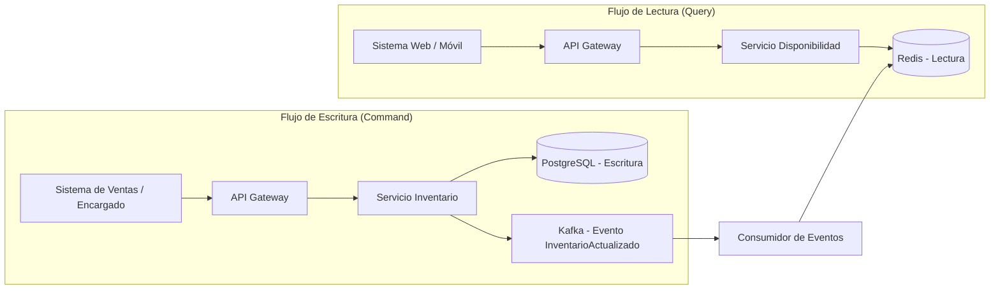

# Arquitectura

## Diagrama

## Explicación

Este documento describe una arquitectura tipo CQRS, donde las operaciones de escritura y lectura se separan para mejorar rendimiento y escalabilidad.

- **Flujo de escritura**: el sistema de ventas envía comandos al API Gateway, que los dirige al servicio de inventario. Este servicio guarda los cambios en PostgreSQL y publica un evento en Kafka.
- **Flujo de lectura**: el sistema web o móvil consulta al API Gateway, que redirige al servicio de disponibilidad. Este servicio lee desde Redis, optimizado para consultas rápidas.
- **Sincronización**: un consumidor de eventos escucha Kafka y actualiza Redis para mantener los datos de lectura sincronizados.
