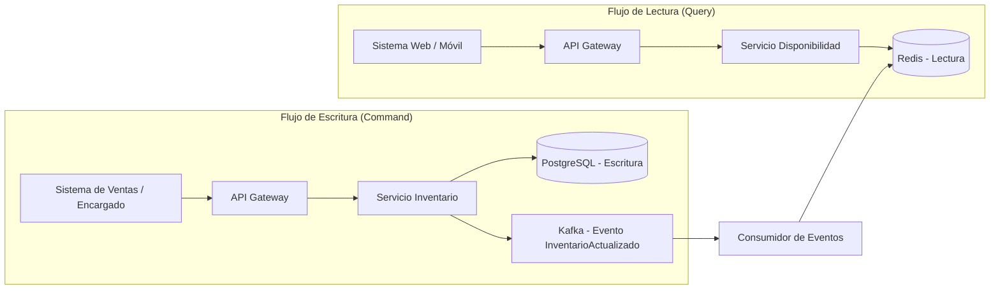

# Arquitectura

```mermaid
graph LR
    subgraph "Flujo de Escritura (Command)"
        A[Sistema de Ventas / Encargado] --> B[API Gateway]
        B --> C[Servicio Inventario]
        C --> D[(PostgreSQL - Escritura)]
        C --> E[Kafka - Evento InventarioActualizado]
    end

    subgraph "Flujo de Lectura (Query)"
        F[Sistema Web / Móvil] --> G[API Gateway]
        G --> H[Servicio Disponibilidad]
        H --> I[(Redis - Lectura)]
    end

    E --> J[Consumidor de Eventos]
    J --> I
```
